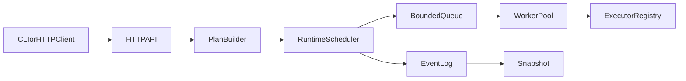

# Execraft

`Execraft` 是一个使用 Go 编写的 DAG 任务编排与执行内核。  
它面向“可控执行、可观测状态、可恢复运行”的自动化场景，提供 HTTP API、实时事件流和命令行工具。

> 本项目为独立重写与创新实现，不是 fork，也不是原项目代码复制。

## 项目亮点

- 事件驱动任务运行时：任务状态变化以事件形式记录与输出
- 并发调度增强：`worker pool + bounded queue + backpressure`
- 可靠执行机制：支持超时、重试、依赖失败传播与下游跳过
- 状态持久化：`events.log`（事件日志）+ `snapshot.json`（快照）双层恢复
- 对外能力完整：REST API + SSE 实时事件流
- CLI 体验友好：`serve` / `submit` / `watch` 子命令

## 适用场景

- AI Agent 动作执行层
- 自动化任务流水线（采集 -> 处理 -> 通知）
- 需要“任务状态可追踪 + 失败可恢复”的轻量后端服务
- 需要通过 HTTP 快速集成任务编排能力的系统

## 与同类实现的差异（创新表）

| 能力维度 | Execraft 实现方式 | 创新点 |
|---|---|---|
| 任务编排核心 | `BuildPlan + ValidateGraph` 两阶段处理 | 规划与执行解耦，降低调度耦合度 |
| 并发模型 | 有界队列 + Worker Pool | 队列过载时主动背压保护 |
| 状态存储 | 事件日志 + 周期快照 | 可审计、可回放、可恢复 |
| 对外接口 | REST + SSE | 支持实时订阅任务生命周期 |
| 使用方式 | CLI 子命令化 | 适合开发与运维直接操作 |

## 架构概览



## 目录结构

- `cmd/execraft`：CLI 入口与子命令
- `internal/domain`：任务模型、图校验、执行计划
- `internal/engine`：调度器、并发池、重试策略
- `internal/executor`：执行器注册与内置执行器
- `internal/store`：内存状态、事件日志、快照恢复
- `internal/api/http`：HTTP 路由与处理器（含 SSE）
- `tests`：单元/模块/集成测试

## 快速开始（Windows PowerShell）

### 1) 构建

```powershell
go build .\cmd\execraft
```

### 2) 启动服务

```powershell
go run .\cmd\execraft serve --http :8090 --data-dir .\data
```

### 3) 提交任务图

示例 `graph.json`：

```json
{
  "tasks": [
    {
      "id": "a",
      "kind": "echo",
      "input": { "msg": "hello" }
    },
    {
      "id": "b",
      "kind": "sleep",
      "input": { "duration_ms": 100 },
      "depends_on": ["a"]
    }
  ]
}
```

提交：

```powershell
go run .\cmd\execraft submit http://localhost:8090 graph.json
```

### 4) 监听实时事件

```powershell
go run .\cmd\execraft watch http://localhost:8090
```

## HTTP API

- `POST /tasks`：提交任务图
- `GET /tasks/{id}`：查询单任务状态
- `GET /tasks?status=success&kind=echo`：按条件筛选任务
- `GET /events/stream`：SSE 实时事件流
- `GET /health`：健康检查
- `GET /metrics`：运行指标

## 配置项

环境变量（命令行参数优先级更高）：

- `EXECRAFT_HTTP_ADDR`（默认 `:8090`）
- `EXECRAFT_DATA_DIR`（默认 `data`）
- `EXECRAFT_MAX_WORKERS`（默认 `8`）
- `EXECRAFT_QUEUE_SIZE`（默认 `64`）
- `EXECRAFT_SNAPSHOT_SEC`（默认 `20`）

## 测试

```powershell
go test ./...
```

覆盖范围：

- Unit：图校验、重试策略
- Module：调度重试、依赖链路
- Integration：HTTP 提交/查询流程

## 合规与致谢

- 致谢原项目 `execgo` 提供产品思路启发
- 本仓库为学习与创新重写，不是 fork，不包含直接复制代码
- 原项目为 MIT 许可证，本项目采用兼容的 MIT 许可证
