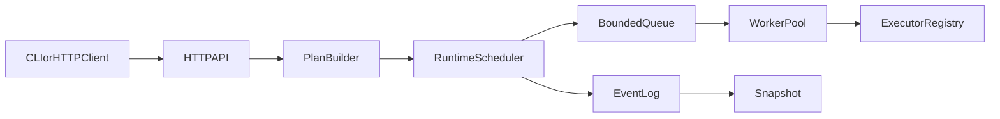

# Execraft

Execraft is a Go-based task orchestration runtime rebuilt from scratch for learning and innovation.
It keeps the high-level problem space of DAG task execution, but uses a different architecture and implementation.

## Highlights

- Event-driven DAG execution runtime in pure Go.
- Worker-pool scheduling with bounded queue and backpressure.
- Retry + timeout handling with dependency-aware failure propagation.
- Append-only event journal plus periodic snapshot recovery.
- REST API and SSE stream for real-time task lifecycle updates.
- CLI subcommands for operation workflows (`serve`, `submit`, `watch`).

## Why This Project

The project targets users who need:

- dependency-aware task execution,
- predictable retries and timeout handling,
- observable task state changes,
- lightweight HTTP automation without a large platform.

## Difference and Innovation Plan Table

| Original capability area | Execraft implementation | Innovation point |
|---|---|---|
| DAG submission and validation | `domain.BuildPlan` + `domain.ValidateGraph` with new model naming and planning phase | two-phase plan/build then runtime execute |
| Concurrency scheduling | `engine.workerPool` with bounded queue | backpressure when queue is saturated |
| Runtime state persistence | append-only `events.log` + `snapshot.json` | event replay and audit-friendly history |
| HTTP task API | fresh handlers in `internal/api/http` | filtered list (`status`, `kind`) and SSE stream endpoint |
| Command-line usage | subcommands `serve`, `submit`, `watch` | operator-focused CLI workflow |

## Architecture



## Project Layout

- `cmd/execraft`: CLI entry and subcommands.
- `internal/domain`: graph/task contracts and planning.
- `internal/engine`: scheduler, worker-pool, retry policy.
- `internal/executor`: task executor registry and builtins.
- `internal/store`: in-memory state store + event log snapshot persistence.
- `internal/api/http`: REST + SSE handlers.
- `tests`: unit, module, and integration tests.

## Quick Start

### Build

```bash
go build ./cmd/execraft
```

### Run server

```bash
./execraft serve --http :8090 --data-dir ./data
```

Windows PowerShell:

```powershell
go run .\cmd\execraft serve --http :8090 --data-dir .\data
```

### Submit a graph

`graph.json` example:

```json
{
  "tasks": [
    { "id": "a", "kind": "echo", "input": { "msg": "hello" } },
    { "id": "b", "kind": "sleep", "input": { "duration_ms": 100 }, "depends_on": ["a"] }
  ]
}
```

Submit:

```bash
./execraft submit http://localhost:8090 graph.json
```

Windows PowerShell:

```powershell
go run .\cmd\execraft submit http://localhost:8090 graph.json
```

Watch events:

```bash
./execraft watch http://localhost:8090
```

Windows PowerShell:

```powershell
go run .\cmd\execraft watch http://localhost:8090
```

## HTTP API

- `POST /tasks`: submit a task graph.
- `GET /tasks/{id}`: fetch one task state.
- `GET /tasks?status=success&kind=echo`: filtered list.
- `GET /events/stream`: SSE stream for runtime events.
- `GET /health`: health probe.
- `GET /metrics`: runtime counters.

## Configuration

Environment variables (flags override env values):

- `EXECRAFT_HTTP_ADDR` (default `:8090`)
- `EXECRAFT_DATA_DIR` (default `data`)
- `EXECRAFT_MAX_WORKERS` (default `8`)
- `EXECRAFT_QUEUE_SIZE` (default `64`)
- `EXECRAFT_SNAPSHOT_SEC` (default `20`)

## Testing

```bash
go test ./...
```

Includes:

- unit tests (graph validation, retry logic),
- module tests (scheduler retry and dependency flow),
- integration tests (HTTP submit/query path).

## Compliance and Acknowledgement

Thanks to the original `execgo` project for product-level inspiration.

This repository is a learning and innovation rewrite, not a fork and not a direct copy.
All code in this repository is newly written with different organization and implementation details.

The original project license is MIT, and this project follows compatible MIT licensing terms.
